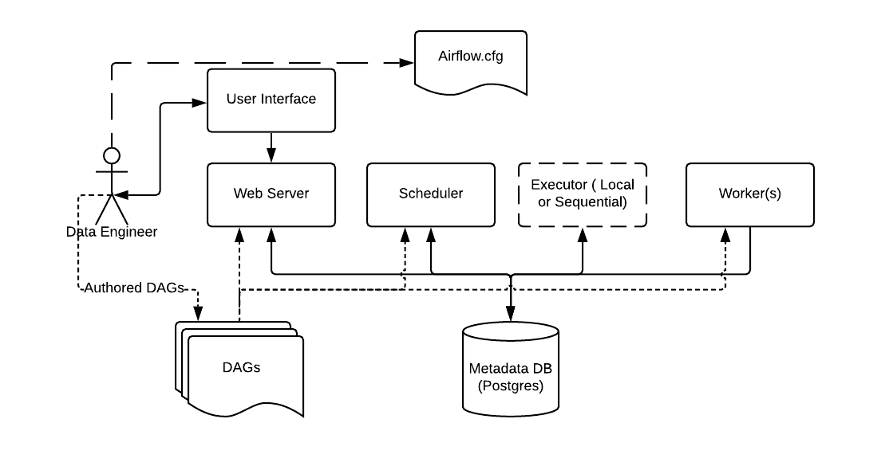
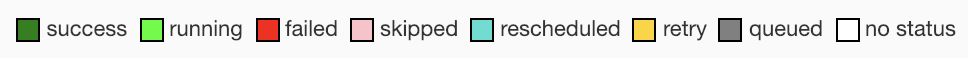

# Airflow Concepts
[출처](https://airflow.apache.org/docs/apache-airflow/stable/concepts.html)
## Basic Airflow Architecture


- Metadata Database: data pipelines 작동에 관한 metadata 저장
- Web Server and Scheduler: Metadata Database 와 상호작용하며, 각 각은 분리된 프로세스에서 작동함
- Executor: Scheduler 안에 포함된 프로세스
- Worker(s): 다른 Airflow components 와 상호작용하는 분리된 프로세스
- airflow.cfg: 설정파일

## 핵심 개념

### DAG Runs
- DAG 가 특정 execution_date 에 인스턴스화 되는 것
- 일반적으로 Airflow scheduluer를 통해 DAG run 생성
- 외부 트리거를 통해 생성될 수 도 있음
- DAG 에 다른  execution_date를 설정함으로써, 동시에 여러 DAG run 을 실행시킬 수 있음

### execution_date
- 논리적인 날짜. 동일한 DAG run, DAG의 task 인스턴스가 속하게 될 id. (실제 DAG 실행 시간이 아님)
- 비유하면 요리 주문서라고 보면됨. (주문서가 들어간 시점하고, 실제 요리가 되는 시점은 다름)
- CLI 가 아닌 웹서버를 통해 작업을 진행하면 execution_date가 자동으로 지정됨
- 사용 시 // execution_date != start_date != 실제 작업이 수행되는 시간 // 차이로 헷갈릴 수 있음
    - [excution_date 정리 잘된 글]](https://m.blog.naver.com/gyrbsdl18/221561318823)
    - [총정리](https://it-sunny-333.tistory.com/157)
    - 간단하게 보면, execution_date는 작업 id로 실제 작업 수행 시간이 아님. start_date를 기준으로 지정된 schedule_interval 단위로 작업이 수행됨
    - start_date 의 00:00 부터 schedule_interval 단위 시간이 지난 이 후에 첫 작업이 시작됨. 그리고 다시 단위 시간이 지난 후 이전 단위 시간에 대한 기록이 수행.
        - 예시) 현재시간: 2021-05-11 08:00(UTC), start_date: 2021-05-10, schedule_interval: '*/10 * * * *' (매 10분만다 실행)
    - airflow에서는 execution_date (ds 라는 이름으로 쓰이기도 함) 를 기준으로 여러 경우의 날짜를 편하게 지정할 수 있는 다양한 context 변수 및 함수를 제공함
- Airflow는 UTC (한국시간-9hour)을 기준으로 작동하기 때문에 정확한 시간에 수행해야하는 작업은 Timezone에 따른 시차도 고려해야함
- schedule_interval 은 start_date 의 timezone에 영향을 받음 (airflow 의  following_schedule 함수 통해 확인 가능)
    - DAG start_date 

### Tasks
- DAG 안에서 수행되는 개별 작업
- Task 는 (다양한) Operator의 구현임

### Tasks 간 관계
```
with DAG('my_dag', start_date=datetime(2016, 1, 1)) as dag:
    task_1 = DummyOperator('task_1')
    task_2 = DummyOperator('task_2')
    task_1 >> task_2 # Define dependencies
```
- 위 DAG 기준으로, task_1은 task_2의 upstream 임. task_2는 task_1의 downstream임.
- up/downstream 은 같은 execution_date 를 갖고 있는 DAG run or task instance 간의 의존성을 의미함 
    - 공식문서에서 다른 작업(execution_date 이 다른) 간 이전 관계는 previous 라는 표현을 씀

### Task Lifecycle
- task stage

    1. No status (scheduler created empty task instance)
    1. Scheduled (scheduler determined task instance needs to run)
    1. Queued (scheduler sent task to executor to run on the queue)
    1. Running (worker picked up a task and is now running it)
    1. Sucess (task completed)

- task life cycle


### Operator
- task 가 수행할 실제 작업
- 가급적 원자성 유지(독립적으로 수행할 수 있도록)
- 오퍼레이터간 정보 공유가 필요할 경우 가급적 단일 오퍼레이터에 작업을 합치는 걸 고려할 것
- 부득이 정보 공유가 필요할 때는 XCom(Operator cross-communication) 기능 활용
- [Operator상세정보](https://airflow.apache.org/docs/apache-airflow-providers/index.html)
- [ListAirflowOperator](https://airflow.apache.org/docs/apache-airflow/stable/python-api-ref.html#pythonapi-operators)

### Sensors
- Operator 의 일종으로, 특정 작업을 기다려줌
- 주로 장시간 실행 중인 태스크를 모니터링하는데 사용됨
- Schedule Mode
    - poke (default): 다음 중 하나의 이벤트가 발생할 때까지 poke_interval 초마다 계속 호출됨
        - poke 가 True 반환 (False 반환 시 다시 호출)
        - poke 가 AirflowSkipException 발생시키면 센서 태스크 인스턴스 상태가 Skip으로 설정됨
        - poke 가 다른 종류의 예외를 발생시킬 경우 retries 횟수만큼 재시도
    - reschedule: 추후 정리
    - smart sensor: 추후 정리

### DAG 할당 
- 1.8 버전 이후 부터 명시적 할당, 지연할당, 추론할당 가능
- 이전에는 명시적 할당만 가능했음
```
dag = DAG('my_dag', start_date=datetime(2016, 1, 1))

# sets the DAG explicitly
explicit_op = DummyOperator(task_id='op1', dag=dag)

# deferred DAG assignment
deferred_op = DummyOperator(task_id='op2')
deferred_op.dag = dag

# inferred DAG assignment (linked operators must be in the same DAG)
inferred_op = DummyOperator(task_id='op3')
inferred_op.set_upstream(deferred_op)
```