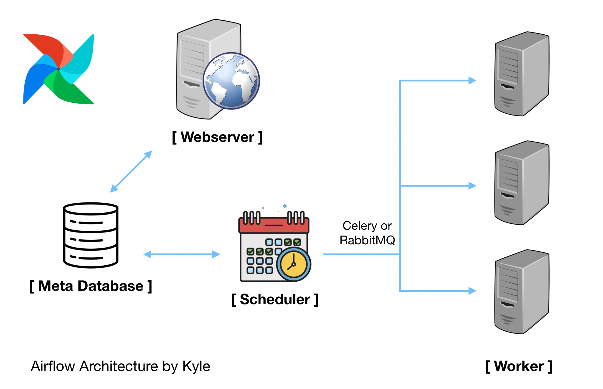

# airflow 사용법
## 구성

- Airflow Webserver - 웹 UI를 표현하고, workflow 상태 표시하고 실행, 재시작, 수동 조작, 로그 확인 등 가능
- Airflow Scheduler
   - 작업 기준이 충족되는지 여부를 확인
   - 종속 작업이 성공적으로 완료되었고, 예약 간격이 주어지면 실행할 수 있는 작업인지, 실행 조건이 충족되는지 등
   - 위 충족 여부가 DB에 기록되면, task들이 worker에게 선택되서 작업을 실행함
## 실행방법
### 로컬 실행 
- 웹서버 실행
```shell
airflow webserver --port 8080
```
- 스케쥴러 실행
```shell
airflow scheduler

```
- test 실행
```shell
#command layout: command subcommand dag_id task_id date
# airflow tasks dag_id task_id date
# testing print_date
airflow tasks test tutorial print_date 2015-06-01
```
- task 실행
```shell
airflow tasks run task_id 
```

## 종료방법
- 

## 기본 사용법 [출처](https://zzsza.github.io/data/2018/01/04/airflow-1/)
### DAG 작성 흐름 요약
- [default_args 정의](#default-arguments)
    - 소유권, 시작날짜, 재시도 관련 등 정의
- [DAG 객체 생성](#dags)
    - dag id, schedule interval 등 정의
- DAG 내부에서 [Operator](#operator)를 통해 Task 생성
- [Tasks](#tasks) 들을 [연결](#set-streams) 

### DAG 상세 [출처](https://moons08.github.io/programming/airflow-basic-concept/)
- Directed Acyclic Graph(비 순환 그래프): 실행하려는 모든 작업의 ​​모음
- 일반적으로 DAG는 각각 하나의 논리적 workflow에 대응
#### Default Arguments
```python
default_args = {
    'owner': 'Airflow' # 각 테스크의 owner. linux username이 추천됨
    'start_date': datetime(2016, 1, 1), # 작업이 시작될 날짜
    'end_date': datetime(2016, 2, 1), # 이 날짜 이후로는 작업을 시행하지 않음
    'retries': 1, # 최대 재시도 횟수
    'retry_delay': timedelta(minutes=5), # 재시도 간 딜레이
    'depends_on_past': False, # true일 경우, 이전 분기 작업이 성공해야만 작업을 진행
    'on_failure_callback':some_function(), # task가 실패했을 경우 호출할 함수, dictype의 context를 전달.
    'on_retry_callback':some_function2(), # 재시도시, 상동
    'on_success_callback':some_function3(), # 성공시, 상동
    'priority_weight': 10, # 이 테스크의 우선순위 가중치, 높을 수록 먼저 triggered
}
```
#### Dags
```python
dag = DAG('my_dag', default_args=default_args)
op = DummyOperator(task_id='dummy', dag=dag)
print(op.owner) # Airflow
```
##### Scope 
- 에어플로우는 DAGfile 안의 모든 DAG 오브젝트들을 불러올 수 있습니다. 다만, 각 오브젝트들은 전역 변수globals()여야 합니다. 아래의 예에서 dag_1만 불려오게 될 것입니다.
```python
dag_1 = DAG('this_dag_will_be_discovered')

def my_function():
    dag_2 = DAG('but_this_dag_will_not')

my_function()
```

### Operator
- [Operator 공식문서](https://airflow.apache.org/docs/apache-airflow/stable/howto/operator/index.html)
- DAG는 workflow를 실행하는 방법을 설명하지만, Operator는 실제로 수행할 작업을 결정합니다.
- 에어플로우는 다음 Operator들을 지원합니다.
    - BashOperator - bash command 실행
    - PythonOperator - 임의의 파이썬 함수 호출
    - EmailOperator - email 송신
    - SimpleHttpOperator - HTTP request 송신
    - MySqlOperator, SqliteOperator, PostgresOperator, MsSqlOperator, OracleOperator, JdbcOperator, etc. - SQL - command 실행
    - Sensor - 다음과 같은 것들을 기다리며 확인 (time, file, database row, S3 key, etc…)
- 위의 나열된 것 보다 훨씬 많은 Operator들이 존재합니다. 이거 있나? 싶으면 보통 있습니다. 다만 contrib 디렉토리에 있는 Operator들은 community에 의해 작성된 것이므로 완벽하지 않을 수 있습니다.
- Operator는 unique한 task_id를 가져야하고, 오퍼레이터별 받는 파라미터가 다를 수 있음

#### Tasks
- Operator가 인스턴스화되면 이를 Task라고 합니다. 매개 변수화 된 작업은 DAG의 노드가 됩니다.
##### Task Instance
- Task Instance는 Task의 특정 실행을 나타내며 (일반적으로 여러 번 실행될 것이기 때문에) dag, task, 특정 시점의 조합으로 구분할 수 있습니다. Task Instance는 “running”, “success”, “failed”, “skipped”, “up for retry” 등의 표시 상태를 가집니다.

### Set Streams
```
op1 >> op2
op1.set_downstream(op2) # 전통적 방법, op1이 완료된 뒤 op2가 실행됩니다.

op2 << op1
op2.set_upstream(op1)

# 양방향 지원이 된답니다.
op1 >> op2 >> op3 << op4
```
```
# Dag를 지정하는데도 적용됩니다.
dag >> op1 >> op2

#위 코드는 아래 코드와 동일한 작업을 합니다.
op1.dag = dag
op1.set_downstream(op2)
```
### Metadata Vailidation
```shell
# initialize the database tables
airflow db init

# print the list of active DAGs
airflow dags list

# prints the list of tasks in the "tutorial" DAG
airflow tasks list tutorial

# prints the hierarchy of tasks in the "tutorial" DAG
airflow tasks list tutorial --tree
```
### Testing
```shell
# airflow dags test [dag_id] [execution_date]
airflow dags test tutorial 2015-06-01

# airflow tasks test [dag_id] [task_id] [execution_date]
airflow tasks test tutorial print_date 2015-06-01
```
### Backfill
- start_date 이 현재 시점보다 이전일 경우 start_date 부터 현재까지 실행되었어야 하는 DAG들을 모두 실행하는 작업
- DAG 옵션 catchup=False 설정 통해 비활성화 할 수 있음
- log file 및 db에 기록함
- depends_on_past=True 설정 시 개별 task instance는 이전 task instance 작업 결과에 영향을 받음
- execution_date==start_date 로 설정 시  해당 task 종속성을 무시함 (pas)

## Data Source 연결
### WEB
- Admin -> Connections 에 설정
### CLI

## 개발환경 세팅 
- [도커+로컬+파이참=쓸만한설정but구버전airflow](https://medium.com/ninjavan-tech/setting-up-a-complete-local-development-environment-for-airflow-docker-pycharm-and-tests-3577ddb4ca94)
- [로컬](https://michal.karzynski.pl/blog/2017/03/19/developing-workflows-with-apache-airflow/)

## Debug / Test
- [pytest](https://godatadriven.com/blog/testing-and-debugging-apache-airflow/)
- [step-for-data-test](https://medium.com/wbaa/datas-inferno-7-circles-of-data-testing-hell-with-airflow-cef4adff58d8)
- [vscode ptvsd debug](https://dev.to/pkourouklidis/how-to-debug-a-tfx-pipeline-in-vscode-2e7i)

## 고급기능
### Context Manager
- DAGs can be used as context managers to automatically assign new operators to that DAG.
```
with DAG('my_dag', start_date=datetime(2016, 1, 1)) as dag:
    op = DummyOperator('op')

op.dag is dag # True
```
### TaskFlow API

### DAG decorator

### Python task decorator
[공식문서 설명](https://airflow.apache.org/docs/apache-airflow/stable/concepts.html#python-task-decorator)
```python
with DAG('my_dag', start_date=datetime(2020, 5, 15)) as dag:
    @dag.task
    def hello_world():
        print('hello world!')


    # Also...
    from airflow.decorators import task


    @task
    def hello_name(name: str):
        print(f'hello {name}!')


    hello_name('Airflow users')
```

### Relationship Builders
[다양한 오퍼레이터 순서 결정법](https://airflow.apache.org/docs/apache-airflow/stable/concepts.html#relationship-builders)
- chain
- cross_downstream

### Cross-Dag Dependencies
- 가급적 의존성 발생 안하게 한 DAG에서 정의하는 걸 추천
- 하지만 다음과 같은 경우같이 DAG 간 소통해야할 경우가 있음
    - 두개의 DAG 가 서로 다른 스케쥴로 가동되야할 경우
    - 서로 다른 팀이 관리하는 DAG가 상호 의존성이 있을 경우
    - task 가 같은 DAG의 task에 의존하지만 다른 execution_date 일 때
- ExternalTaskSensor
    - DAG에 있는 task를 다른 execution_date의 DAG에 있는 task가 완료될 때 까지 기다리게함
    - allowed_states, failed_state 의 option을 통해 성공/실패 상태를 지정할 수 있음
- ExternalTaskMarker
    - parent_dag 의 parent_task 가 cleared(실행 상태 초기화) 될 때, 특정 execution_date 의 child_dag 속 child_task1 가 함께 cleared되어야 할 때 사용
    - parent_task 를 clear할 때 "Recursive"가 선택되어있어야지만 child_task1도 clear됨

### Modules Management
- DAG 와 Airflow configuration에서 추가적인 python module을 사용하는 방법
[참고](https://airflow.apache.org/docs/apache-airflow/stable/modules_management.html)
- 파이썬 패키지를 만들어 쓰는 방법 (상세 방법은 공식홈페이지 설명 참고)
    - setuptools와 wheel을 이용해 pip install 로 설치
- path에 directory 경로 추가
    ```
    PYTHONPATH=/home/arch/projects/airflow_operators python
    ```
## Tips
- webserver pid 는 $AIRFLOW_HOME/airflow-webserver.pid 에 기록됨
    - kill -9 pid 로 삭제하거나
    - kill -9 $(lsof -t -i:8080) 으로 웹서버 포트를 이용해서 process 종료 가능
        - lsof => 시스템에 열려있는 파일에 대한 정보 출력, t옵션 : pid만 출력 , -i:port번호 로 특정 포트 사용 프로세스 확인 가능
- Task간 데이터를 주고 받을 경우
    - xcom 사용
    - Admin -> xcom 에서 설정
        - xcome에 데이터 저장 (xcom_push)
        ```
        task_instance = kwargs['task_instance']
        task_instance.xcom_push(key='the_key', value=my_str)
        ```
        - 다른 task에서 데이터 불러오기 (xcom_pull)
        ```
        task_instance.xcom_pull(task_ids='my_task', key='the_key')
        ```
    - PythonOperator에서 사용하는 python_callable 함수에서 return하는 값은 xcom에 자동으로 push됨
- DAG 폴더 안에 dag들을 목적에 따라 서브 폴더로 관리하고 싶은 경우
    - [방법1](https://stackoverflow.com/questions/43218813/how-to-set-up-multiple-dag-directories-in-airflow)
    - [방법2](https://xnuinside.medium.com/how-to-load-use-several-dag-folders-airflow-dagbags-b93e4ef4663c)
- DAG에서 다른 DAG에 종속성이 필요한 경우
    - ExternalTaskSensor 사용
    - 1개의 DAG에서 하면 좋지만, 여러 사람이 만든 DAG이 있고 그 중 하나를 사용해야 할 경우도 있음
- 특정 DAG을 Trigger하고 싶은 경우
    - TriggerDagRunOperator 사용
    - [예제](https://github.com/apache/airflow/blob/master/airflow/example_dags/example_trigger_controller_dag.py)
- 특정 Task의 성공/실패에 따라 다른 Task를 실행시키고 싶은 경우
    - Airflow Trigger Rule 사용
    - 예를 들어 앞의 두 작업중 하나만 실패한 경우
    - [Document 참고](https://airflow.apache.org/docs/apache-airflow/stable/concepts.html#trigger-rules)
- Jinja Template이 작동하지 않는 경우
    - 우선 provide_context=True 조건을 주었는지 확인
    - Jinja Template이 있는 함수의 파라미터가 어떤 것인지 확인
    - Operator마다 Jinja Template을 해주는 template_fields가 있는데, 기존 정의가 아닌 파라미터에서 사용하고 싶은 경우 새롭게 정의
    ```python
    class MyPythonOperator(PythonOperator):
        template_fields = ('templates_dict','op_args')
    ```
- Airflow 변수를 저장하고 싶은 경우
    - Variable 사용
    - Admin - Variables에서 볼 수 있음
    - json 파일로 변수 저장해서 사용하는 방식을 자주 사용함
    ```python
    from airflow.models import Variable

    config=Variable.get(f"{HOME}/config.json", deserialize_json=True)
    environment=config["environment"]
    project_id=config["project_id"]
    ```
- Task를 그룹화하고 싶은 경우
    - dummy_operator 사용
    - workflow 목적으로 사용하는 경우도 있음. 일부 작업을 건너뛰고 싶은 경우, 빈 작업 경로를 가질 수 없어서 dummy_operator를 사용하기도 함
- 1개의 Task이 완료된 후에 2개의 Task를 병렬로 실행하기
    - task1 >> [task2_1, task_2_2]
- 앞선 Task의 결과에 따라 True인 경우엔 A Task, False인 경우엔 B Task를 실행해야 하는 경우
    - BranchPythonOperator 사용
    - python_callable에 if문을 넣어 그 다음 task_id를 정의할 수 있음
    - 단순하게 앞선 task가 성공, 1개만 실패 등이라면 trigger_rule만 정의해도 됨
- Airflow에서 Jupyter Notebook의 특정 값만 바꾸며 실행하고 싶은 경우
    - Papermill 사용
    - [참고 문서](https://zzsza.github.io/mlops/2020/03/08/airflow-with-notebook-using-papermill/)
- UTC 시간대를 항상 생각하는 습관 갖기
    - execution_date이 너무 헷갈림
    - [박호균님의 블로그 참고](https://blog.naver.com/gyrbsdl18/221561318823)

- Task가 실패했을 경우 슬랙 메세지 전송하기
    - [Integrating Slack Alerts in Airflow](https://medium.com/datareply/integrating-slack-alerts-in-airflow-c9dcd155105)
- Hook이란?
    - Hook은 외부 플랫폼, 데이터베이스(예: Hive, S3, MySQL, Postgres, Google Cloud Platfom 등)에 접근할 수 있도록 만든 인터페이스
    - 대부분 Operator가 실행되기 전에 Hook을 통해 통신함
    - [공식 문서 참고](https://airflow.apache.org/docs/apache-airflow/stable/concepts.html#hooks)
- 머신러닝에서 사용한 [예시는 Github 참고](https://github.com/zzsza/fastcampus-machine-learning-project/tree/master/03-Taxi-Demand-Prediction)
- Context Variable이나 Jinja Template의 ds를 사용해 Airflow에서 날짜를 컨트롤 하는 경우, Backfill을 사용할 수 있음
과거값 기준으로 재실행
    - 단, 쿼리에 CURRENT_DATE() 등을 쓰면 Airflow에서 날짜를 컨트롤하지 않고 쿼리에서 날짜 컨트롤하는 경우라 backfill해도 CURRENT_DATE()이 있어서 현재 날짜 기준으로 될 것임
    ```
    airflow backfill -s 2020-01-05 -e 2020-01-10 dag_id
    ```
    - backfill은 기본적으로 실행되지 않은 Task들만 실행함. DAG을 아예 다시 실행하고 싶다면 --reset_dagruns를 같이 인자로 줘야 함
    ```
    airflow backfill -s 2020-01-05 -e 2020-01-10 --reset_dagruns dag_id
    ```
    - 실패한 Task만 재실행하고 싶다면 --rerun_failed_task를 사용함
    ```
    airflow backfill -s 2020-01-05 -e 2020-01-10 --reset_failed_task dag_id
    ```
    - airflow backfill이 아닌 강제로 trigger를 하고 싶다면 다음 명령어 사용
    ```
    airflow trigger_dag dag_id -e 2020-01-01
    ```
- 재시도시 Exponential하게 실행되길 원하면 retry_exponential_backoff 설정 (재시도 간 간격 지수적으로 증가)
- airflow 1.10.8, 1.10.9 버전부터 tag 기능이 생김. DAG을 더 잘 관리할 수 있음
```
dag = DAG(
    dag_id='example_dag_tag',
    schedule_interval='0 0 * * *',
    tags=['example']
)
```  