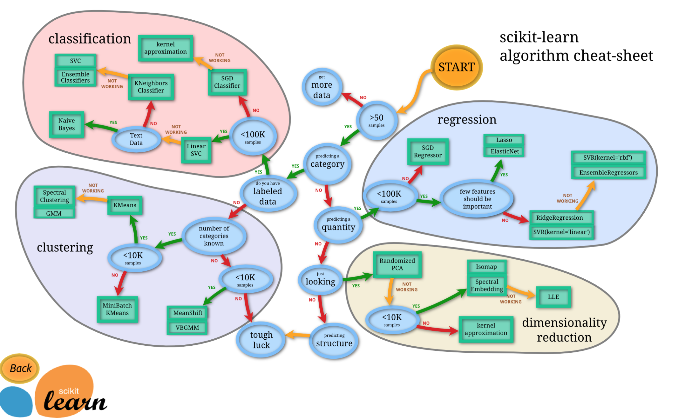

# Machine Learning Algorithm

## 지도 학습
- [ ] k최근접 이웃
- [ ] 선형 회귀
- [ ] 로지스틱 회귀
- [ ] 서포트 벡터 머신
- [ ] 결정 트리와 랜덤 포레스트
- [ ] 신경망

## 비지도 학습
- [ ] 군집
    - [ ] 이상치 탐지, 특이치 탐지
    - [ ] k-평균
    - [ ] DBSCAN
    - [ ] 계층 군집 분석(HCA)
    - [ ] 원 클래스
    - [ ] 아이솔레이션 포레트스트
- [ ] 시각화와 차원축소
    - [ ] 주성분 분석(PCA)
    - [ ] 커널(PCA)
    - [ ] 지역적 선형 임베딩 (LLE)
    - [ ] t-SNE
- [ ] 연관 규칙 학습
    - [ ] 어프라이어리
    - [ ] 이클렛

## 준지도 학습
- 구글 포토 호스팅

## 강화 학습
- '에이전트'가 환경을 관찰해서 행동하고 그 결과로 '보상' 또는 '벌점'을 받으며, 가장 큰 보상을 얻기 위한 '정책'을 학습.
- 알파고

## 회귀
- 캘리포니아 주택 가격
- 감성분석
## 분류
- 스팸필터링
- 신용카드 사기탐지
- VIP 고객 여부
- 제조 결함 탐지
- 약물 효능 검사

## 추천
- 상품추천

## 대체 
- 손상된 고객 데이터 보충
- 인구조사 자료 보충 

