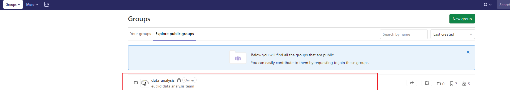
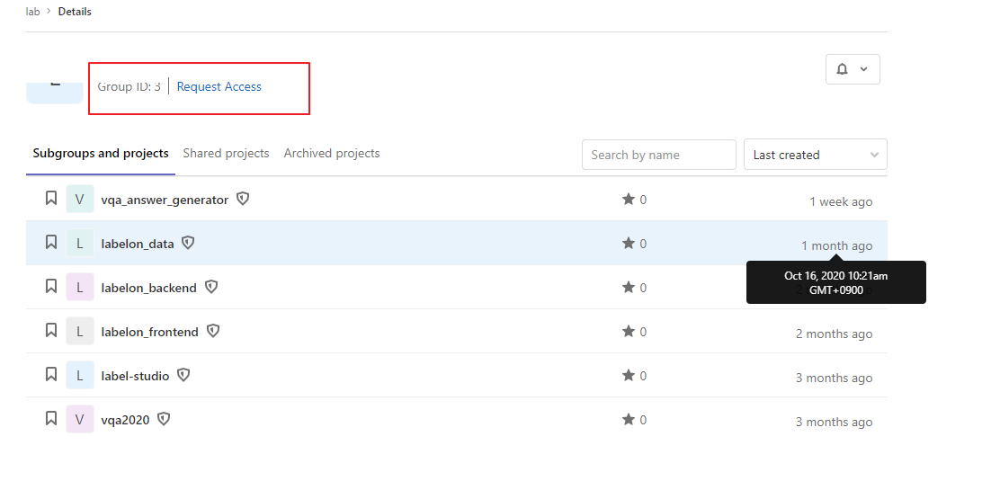
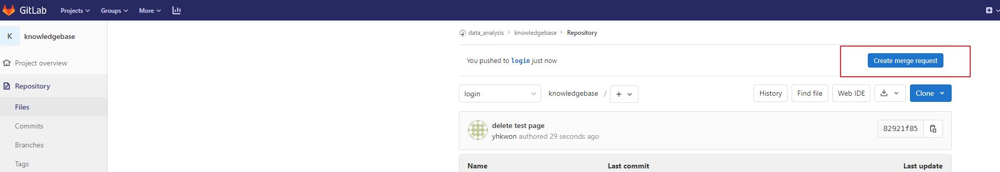

### 깃 설치 - 설치 안되어있을 경우 (윈도우 기준)
[git_download_window](https://gitforwindows.org/)

---

### 내부망 gitlab 가입
${removed_info}/

---
### data_analysis group 접근 신청



----  


### 사용자 설정 (최초 git 사용시)
```
$ git config --global user.name "본인이 사용할 이름"
$ git config --global user.email "사용할 이메일 주소"
```
##### 1. clone project 최초 프로젝트 체크아웃 시
```
$ git clone ${removed_info}/data_analysis/knowledgebase.git
```
##### 2. feature 브랜치 생성 및 체크아웃
```
<!-- $branch-name: 구현기능 이름으로 지정  -->
$ git checkout -b [branch name]

# 위의 명령어는 아래의 두 명령어를 합한 것
$ git branch [branch name]
$ git checkout [branch name]
```
##### 3. 코드작성 후 코드 commit
```
$ git commit -a -m "#이슈번호: comment 작성(간단하게 작성 ex: add login func) "

# 위의 명령어는 아래의 두 명령어를 합한 것
$ git add . # 변경된 모든 파일을 스테이징 영역에 추가
$ git add [some-file] # 스테이징 영역에 some-file 추가
$ git commit -m "Write commit message" # local 작업폴더에 history 하나를 쌓는 것
```

##### 4. 코드 push
```
# -u 옵션: 새로운 기능 브랜치와 동일한 이름으로 중앙 원격 저장소의 브랜치로 추가한다.

// 로컬의 기능 브랜치를 중앙 원격 저장소 (origin)에 올린다.
$ git push -u origin feature/login branch

// -u 옵션으로 한 번 연결한 후에는 옵션 없이 아래의 명령만으로 기능 브랜치를 올릴 수 있다.
$ git push -origin feature/login branch
```

#### 5. commit 검토 후 merge request

#### 6. 원격저장소와 로컬저장소 동기화
```
$ git checkout master
$ git pull origin master
//pull 이 후 본인 코드 반영 확인 후 local에서 완성한 이전 작업 브랜치 삭제
$ git branch -d feature/login
```
- [참고 - git 기초 ](https://backlog.com/git-tutorial/kr/intro/intro1_1.html)
- [참고 - git 심화 ](https://mylko72.gitbooks.io/git/content/)
- [참고 - git 협업 방법](https://gmlwjd9405.github.io/2017/10/27/how-to-collaborate-on-GitHub-1.html)
- [참고 - gitflow](https://gmlwjd9405.github.io/2018/05/12/how-to-collaborate-on-GitHub-3.html)
- [참고 - gitlab flow](http://developer.gaeasoft.co.kr/development-guide/workflow/gitlab-workflow-guide/)
