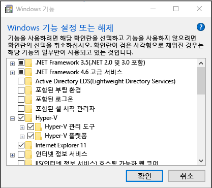

### 개발 환경 정보
개발 환경과 운영환경을 동일하게 가져가고, 개발 환경 구축의 용이함을 위해 docker를 사용합니다.
개발 및 배포는 docker container를 이용하여 이뤄지므로 docker가 설치 되어 있지 않다면 
아래 절차 또는 인터넷 검색을 통해 docker를 설치하십시오.
[공식설치가이드](https://docs.docker.com/docker-for-windows/install/) 를 참고할 것을 권장합니다.


### 1. 윈도우 wsl2 접속환경 만들기
wsl2 는 윈도우에서 리눅스를 구동할 수 있도록 돕는 윈도우 기능입니다.
가상머신 사용보다 가볍고 빠르므로 wsl2 를 사용하여 리눅스 구동 환경을 만들겠습니다.

##### - bios 에서 가상화 기술 설정 
메인보드마다 설정방법이 다릅니다. 
구글에 본인 메인보드 회사이름과 가상화 기술 켜기로 검색해서 적용하도록 합니다.
ex) 인텔 가상화 기술 켜기

##### - 윈도우 hyper-v 기능 켜기
Windows 단추를 마우스 오른쪽 단추로 클릭하고 '앱 및 기능'을 선택합니다.
오른쪽의 관련 설정에서 프로그램 및 기능를 선택합니다.
Windows 기능 사용/사용 안 함을 선택합니다.
Hyper-V를 선택하고 확인을 클릭합니다.
Windows 프로그램 및 기능 대화 상자

설치가 완료되면 컴퓨터를 다시 시작하라는 메시지가 표시됩니다.


### 2. docker-desktop install
[공식설치가이드](https://docs.docker.com/docker-for-windows/install/)
- docker-desktop stable version 다운로드
[download_url] (https://hub.docker.com/editions/community/docker-ce-desktop-windows/)


### 3. visual studio code 설치
개발 편의성을 위해 vscode를 사용할 것을 추천.
extension 을 통해 wsl2 접속 및 docker container 사용을 편하게 할 수 있음
[vscode - download](https://code.visualstudio.com/)
vscode 설치 후 extension에서 Remote Development, Docker 설치

그 외 추천 extension:
(eclipse 가 익숙한 경우)eclipse 단축키 사용 : Eclipse Keymap
아나콘다 사용 관련: Anaconda Extension Pack
파이썬 관련: Python
장고 관련: Django
자동완성 : Visual Studio IntelliCode

### 4. knowledgebase 소스 받기 (c드라이브 project라는 폴더에 git clone 받은 경우를 예시로 듦)
```
# 사내 git lab 가입 및 data_analysis 그룹에 참여가 선행되어야 함
# wsl2 ubuntu 커맨드 환경하에서 진행하는 것으로 가정함
$ cd /mnt/c/project/
$ git clone ${removed_info}/data_analysis/knowledgebase.git

# .env 파일 생성(db접속 정보 및 django port 설정 정보)
$ cd knowledgebase/was_server
$ cp sample_env .env

```


git으로 소스 관리 하는 방법은 아래 링크 참조
[git 사용법 참고](./git_guide.md)

### 4. 개발환경 구동
```
# git으로 받은 소스 경로 이동 
```

### 5. gitlab에 개발 소스 반영


### 6. (관리자만 수행) 배포
