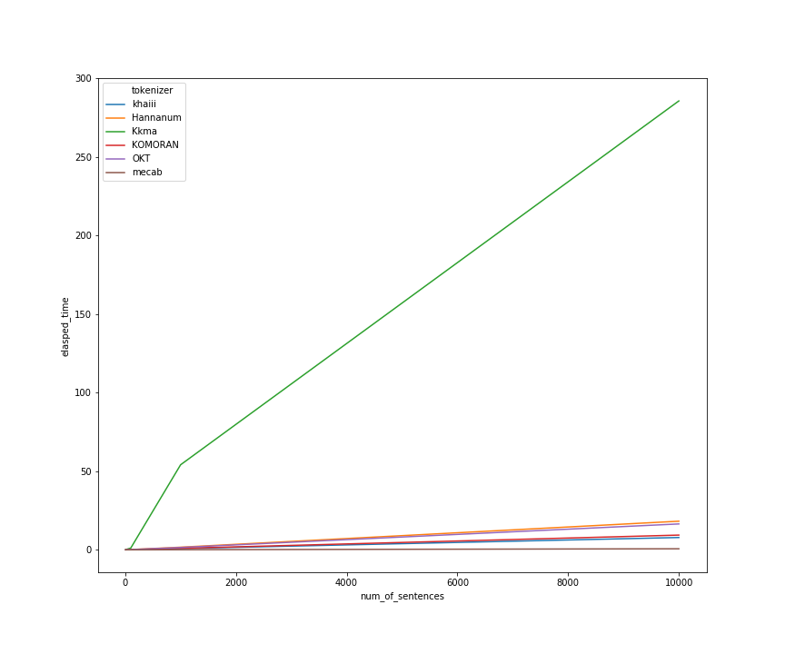
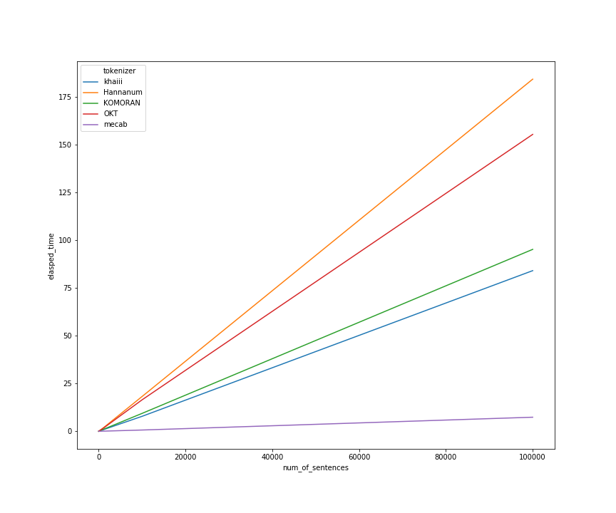
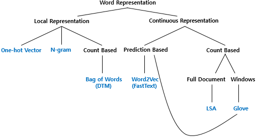

## NLP 머신러닝 워크플로우


### 텍스트 전처리
1. 토큰화 시 고려사항
    1) 구두점이나 특수문자를 단순 제외 하면 안됨
    예) - 마침표로 문장의 경계를 알 수 있음
        - 단어자체에 구두점 (Ph.D, AT&T)
        - 단위($45.55, 123,456,789)
2. 문장 토큰화
한글 문장 토크나이저
```python
$ pip install kss
import kss

text='딥 러닝 자연어 처리가 재미있기는 합니다. 그런데 문제는 영어보다 한국어로 할 때 너무 어려워요. 농담아니에요. 이제 해보면 알걸요?'
print(kss.split_sentences(text))
```

3. 이진 분류기
```
문장 토큰화에서의 예외 사항을 발생시키는 마침표의 처리를 위해서 입력에 따라 두 개의 클래스로 분류하는 이진 분류기(binary classifier)를 사용하기도 합니다.

물론, 여기서 말하는 두 개의 클래스는
1. 마침표(.)가 단어의 일부분일 경우. 즉, 마침표가 약어(abbreivation)로 쓰이는 경우
2. 마침표(.)가 정말로 문장의 구분자(boundary)일 경우를 의미할 것입니다.

이진 분류기는 앞서 언급했듯이, 임의로 정한 여러가지 규칙을 코딩한 함수일 수도 있으며, 머신 러닝을 통해 이진 분류기를 구현하기도 합니다.

마침표(.)가 어떤 클래스에 속하는지 결정을 위해서는 어떤 마침표가 주로 약어(abbreviation)으로 쓰이는 지 알아야합니다. 그렇기 때문에, 이진 분류기 구현에서 약어 사전(abbreviation dictionary)는 유용하게 쓰입니다. 영어권 언어의 경우에 있어 https://public.oed.com/how-to-use-the-oed/abbreviations/
해당 링크는 약어 사전의 예라고 볼 수 있습니다.

이러한 문장 토큰화를 수행하는 오픈 소스로는 NLTK, OpenNLP, 스탠포드 CoreNLP, splitta, LingPipe 등이 있습니다. 문장 토큰화 규칙을 짤 때, 발생할 수 있는 여러가지 예외사항을 다룬 참고 자료로 아래 링크를 보면 좋습니다.
https://www.grammarly.com/blog/engineering/how-to-split-sentences/
```

4. 한국어 토큰화
- 한국어는 교착어 이므로 어절 토큰화는 지양
교착어: 조사, 어미 등을 붙여서 말을 만드는 언어
또한 한국어는 띄어쓰기가 잘 지켜지지가 않는다.
=> 형태소(뜻을 가진 가장 작은 말의 단위) 토큰화를 통해 진행
=> 한글 형태소 단위 분석기
[비교 정리1](https://iostream.tistory.com/144)
[비교 정리2](http://www.engear.net/wp/%ED%95%9C%EA%B8%80-%ED%98%95%ED%83%9C%EC%86%8C-%EB%B6%84%EC%84%9D%EA%B8%B0-%EB%B9%84%EA%B5%90/)
### 한국어형태소 분석기 비교
출처: https://iostream.tistory.com/144
```
khaiii: 카카오, 딥러닝 기반 분석기
Okt(Open Korea Text): 
메캅(Mecab): 속도 빠름 
코모란(Komoran): 
한나눔(Hannanum): 
꼬꼬마(Kkma):
노리(Nori):
```
##### 성능비교
|분석기로딩|시간 (초)|
|----------|--------|
|khaiii|0.0016|
|한나눔|0.0001|
|꼬꼬마|0.0002|
|KOMORAN|0.9542|
|Open Korean Text (이하 OKT)|0.0001|
|mecab|0.0004|

=> 꼬꼬마 못써먹음

=> mecap이 가장 빠름

##### 품질비교

- 띄어쓰기가 없는 문장
띄어쓰기가 안되어있을 땐 분석이 쉽지 않음.
실험 문장 1: 너무기대안하고갔나재밌게봤다

그나마 꼬꼬마, komoran, mecab이 나음
(결과는 출처확인)

- 자소 분리 및 오탈자가 포함된 문장
실험 문장 1: ㄱㅐOOO같은영화 뭐가무섭다는건지ㅡㅡ

KOMORAN만 유일하게 자소가 분리된 문장이나 오탈자에 대해서도 어느 정도 강건함을 보여주고 있습니다. 확실하진 않지만 추측컨데, 다른 형태소 분석기는 최소 단위를 음절로 보고 KOMORAN은 자소로 보고 학습을 한 것으로 보이네요.

- 긴 문장
실험 문장: 개봉했을때부터 지금까지 마음이답답하거나 힘들때 이영화 보고있어요 그때마다 심적인 위로를 받을수있는영화같아요 장면 하나하나가 너무예쁘고 마음에 남아서 진한 여운까지 주는영화 감사합니다

긴 문장이지만 띄어쓰기가 어느 정도 되어있는 문장에 대해서 테스트 결과입니다. 조금씩의 차이는 있지만 대부분의 분석기들이 잘 분석해주고 있는 것을 볼 수 있습니다. 따라서 문장의 길이는 띄어쓰기 유무와 자소/오탈자와 달리 형태소 분석기의 분석 품질에 큰 영향을 주지 않는 것으로 보입니다


##### 결론
사용할 데이터의 특성(띄어쓰기 유무 등)이나 개발 환경(Python, Java)에 따라서 적합한 형태소 분석기를 고려해야함
연산 속도가 중요하다면 mecab을 최우선으로 고려해야하며, 심지어 분석 품질도 상위권으로 보여짐
자소 분리나 오탈자에 대해서도 어느 정도 분석 품질이 보장되야 한다면 KOMORAN 사용을 고려
한나눔과 khaiii는 일부 케이스에 대한 분석 품질, 꼬꼬마는 분석 시간에서 약간 아쉬운 점이 보임

출처: https://iostream.tistory.com/144 [Almost Baseball, CSE and Diary]

[그외 성능비교 코드소스](https://github.com/konlpy/konlpy/blob/master/docs/morph.py)


#### 정제 및 정규화
- 대소문자 통합
- 불용어제거 (등장빈도, 단어 길이 짧은거 등)
```python
# 길이가 1~2인 단어들을 정규 표현식을 이용하여 삭제
import re
text = "I was wondering if anyone out there could enlighten me on this car."
shortword = re.compile(r'\W*\b\w{1,2}\b')
print(shortword.sub('', text))
```
[한글불용어리스트](https://www.ranks.nl/stopwords/korean)

#### 정수 인코딩
컴퓨터가 처리하기 편하도록 텍스트를 정수화:
문장분리 -> 토큰화 -> 정제 -> 빈도수 계산
-> 높은 빈도수 단어 순으로 낮은 정수 인덱스 부여
-> 문장 중 가장 길이가 긴 문장에 맞춰 나머지 문장 정수 빈값 패딩


#### 원-핫 인코딩
정수화기법
1. 단어집합 만들기
2. 단어 집합의 각 단어들을 정수로 인덱싱(보통 빈도수 적용하여 높은 빈도수가 낮은 인덱스)
3. 단어 집합의 크기 차원의 벡터에서 단어 인덱스의 값은 1 나머지는 0
```python
from tensorflow.keras.preprocessing.text import Tokenizer
from tensorflow.keras.utils import to_categorical

text="나랑 점심 먹으러 갈래 점심 메뉴는 햄버거 갈래 갈래 햄버거 최고야"

t = Tokenizer()
t.fit_on_texts([text])
print(t.word_index) # 각 단어에 대한 인코딩 결과 출력.
{# '갈래': 1, '점심': 2, '햄버거': 3, '나랑': 4, '먹으러': 5, '메뉴는': 6, '최고야': 7}
sub_text="점심 먹으러 갈래 메뉴는 햄버거 최고야"
encoded=t.texts_to_sequences([sub_text])[0]
print(encoded)
# [2, 5, 1, 6, 3, 7]
one_hot = to_categorical(encoded)
print(one_hot)
"""
[[0. 0. 1. 0. 0. 0. 0. 0.] #인덱스 2의 원-핫 벡터
 [0. 0. 0. 0. 0. 1. 0. 0.] #인덱스 5의 원-핫 벡터
 [0. 1. 0. 0. 0. 0. 0. 0.] #인덱스 1의 원-핫 벡터
 [0. 0. 0. 0. 0. 0. 1. 0.] #인덱스 6의 원-핫 벡터
 [0. 0. 0. 1. 0. 0. 0. 0.] #인덱스 3의 원-핫 벡터
 [0. 0. 0. 0. 0. 0. 0. 1.]] #인덱스 7의 원-핫 벡터
"""
```
##### 원핫인코딩 한계
- 단어 개수 만큼 차원이 늘어남 (저장공간 비효율적)
- 단어의 유사도 표현 안됨
=> 단어의 다른 의미를 다차원공간에 벡터화
-> 카운트기반: LSA, HAL
-> 예측 기반: NNLM, RNNLM, Word2Vec, FastText
-> 두가지 모두: GloVe

#### 한국어 전처리 패키지
1. PyKoSpacing : 띄어쓰기로 변환
```
!pip install git+https://github.com/haven-jeon/PyKoSpacing.git
```
2. Py-Hanspell: 맞춤법검사 및 띄어쓰기
```
!pip install git+https://github.com/ssut/py-hanspell.git
```
3. SOYNLP: 품사,토큰화. 비지도학습 기반. 데이터에 자주 등장하는 단어들 분석. (응집확률, 브랜칭 엔트로피 활용)
응집확률: 내부 문자열이 얼마나 응집하여 자주 등장하는지 판단 척도. 왼쪽부터 순서대로 문자를 추가하며 각 문자열이 주어졌을 때 그 다음 문자가 나올 확률을 계산하여 누적곱.
브랜칭 엔트로피: 주어진 문자열에서 얼마나 다음 문자가 등장할 수 있는지 판단하는 척도
```python
!pip install soynlp
# 훈련 데이터를 통해 단어 토크나이징
import urllib.request
from soynlp import DoublespaceLineCorpus
from soynlp.word import WordExtractor
urllib.request.urlretrieve("https://raw.githubusercontent.com/lovit/soynlp/master/tutorials/2016-10-20.txt", filename="2016-10-20.txt")
# 훈련 데이터를 다수의 문서로 분리
corpus = DoublespaceLineCorpus("2016-10-20.txt")
word_extractor = WordExtractor()
word_extractor.train(corpus)
word_score_table = word_extractor.extract()

```
#### 언어모델
언어모델이란 단어 시퀀스(문장)에 확률을 할당하는 모델.
통계를 이용한 방법, 인공 신경망을 이용한 방법이 있음


#### 단어표현방법


국소 표현(Local Representation) : 단어 자체만 . 특정값 맵핑 == 이산 표현(Discrete Representation)
분산 표현(Distributed Representation) : 주변참고해 단어 표현 == 연속 표현(Continuous Represnetation)
